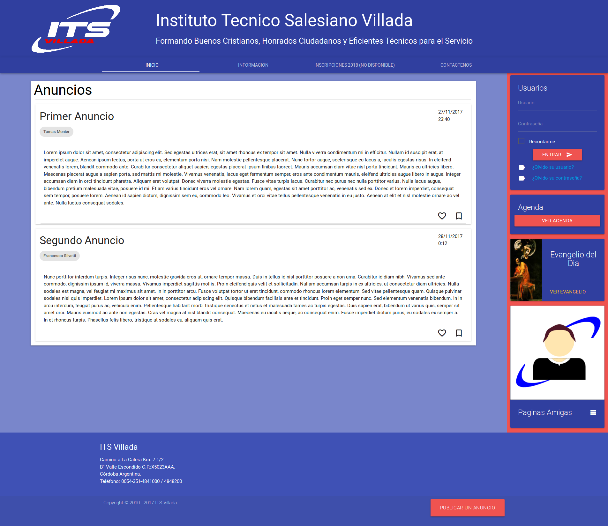
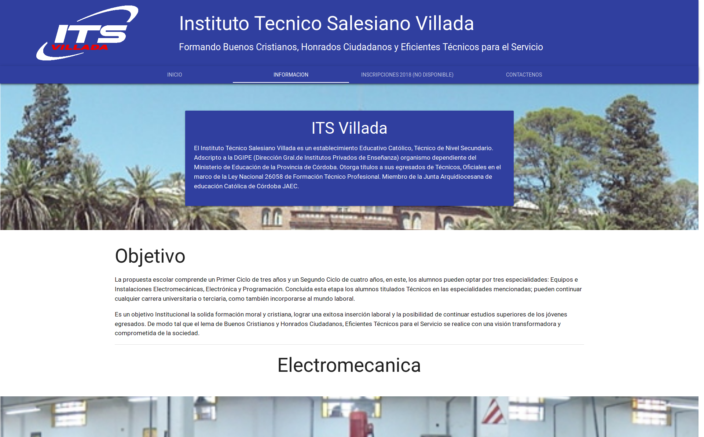
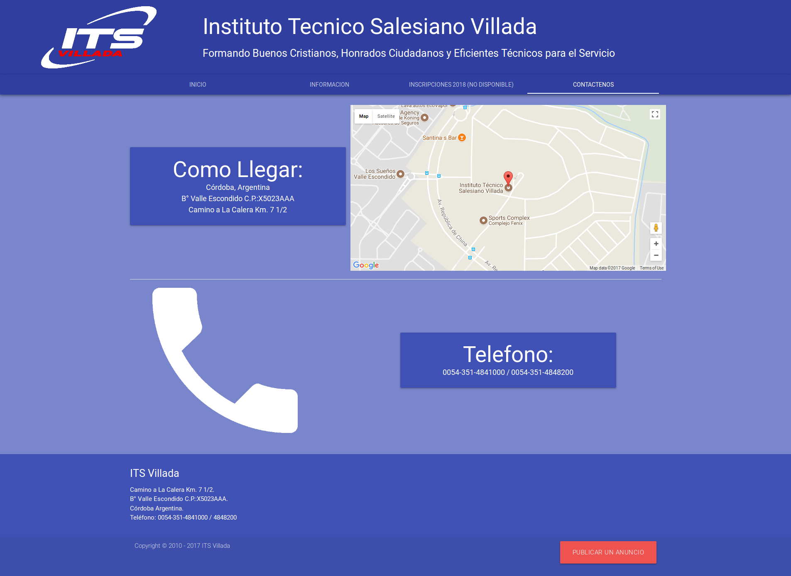
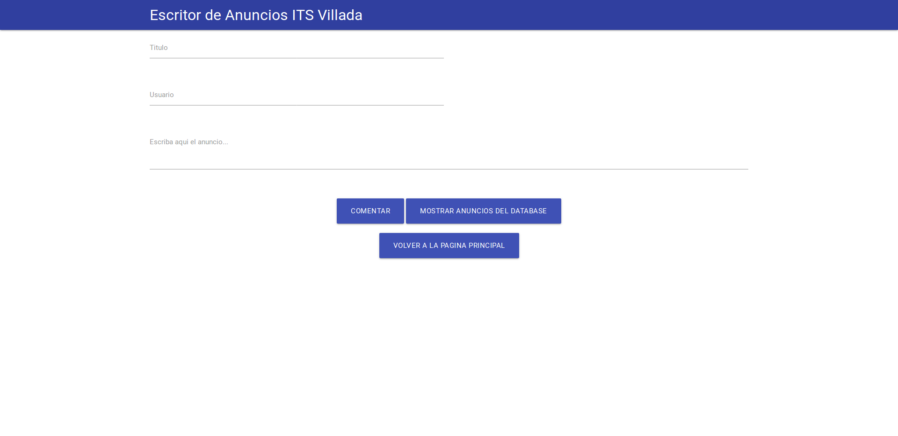
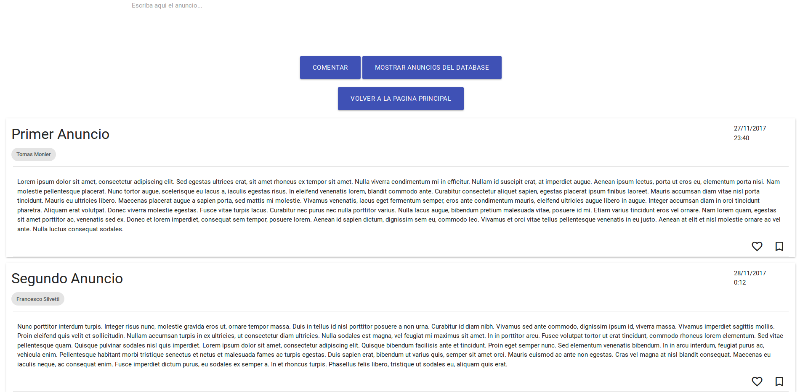

# **Proyecto Trimestral Final - Programacion (HTML - CSS - JS)**
---
#### **Alumno:** Monier Tomas
#### **Curso:** 5ºC
#### **Materia:** Sistemas de Informacion

---

### **Idea del proyecto:** 
Pagina informativa e interactiva del colegio ITS Villada

### **Objetivo:**
Crear una pagina web HTML, utilizando como recursos CCS y JavaScript, en la cual se
muestren los datos principales de la institucion de manera simple tanto para los alumnos y sus
padres como para los nuevos visitantes que esten interesados en inscribirse en el Villada. Tambien
se pondra a disposicion un campus virtual donde los la institucion y los docentes podran
comunicarse con el alumnado.
Todo el proyecto constara de un sitio web divido en dos partes:
- Una **parte infomativa** donde los nuevos visitantes encuentren la informacion necesaria para
aclarar sus dudas y poder contactarse con la institucion. Ademas, si quieren podran empezar
desde aquí el proceso de inscripcion de nuevos alumnos para el siguiente ciclo lectivo
- Otra **parte interactiva**, lo que seria una especie de campus virtual, donde alumnos y
docentes puedan interactuar y asi mejorar la comunicación entre ellos para una educacion
mas fluida

### **Ideas de secciones planteadas (Ideas Iniciales):**
**Ventana Principal:**  Se mostraran los datos mas relevantes, las ultimas novedades y los accesos a las otras secciones
**Seccion Informativa:** Conjunto de paginas que ofrezcan de manera simple y efectiva la mayor cantidad de infomacion disponible del colegio a los nuevos visitantes
**Seccion de Inscripcion:** Paginas que permitan el inicio del proceso de inscripcion de un nuevo alumno. Estas permiten la introduccion de informacion, especificada por la institucion, mediante cuestionarios para permitir la inscripcion
**Seccion alumnos y docentes (Campus Virtual):** Consiste en toda un area de paginas supervisada por los responsables de la pagina y los docentes para la transmicion de tareas, eventos o comunicados a todo el alumnado. Ademas, los alumnos podran comunicarles sus dudas a los docentes en cualquier momento
**Seccion de Contacto:** Aqui los visitantes podran encontran los recursos necesarios para poder comunicarse con la institucion por los medios disponibles o para ubicar en el mapa a la escuela

### **Ventanas Creadas (Producto Final):**
**Pagina Inicio:**
]
Es la pagina principal, donde se encontraran los ultimos anuncios hechos por la institucion, los cuales estan guardados en una base de datos (Firebase Realtime Database), y se podran acceder a otras opciones o ventanas de la pagina. 
**Barra de Navegacion:**
- Es la parte superior de la pagina, donde podemos acceder a las otras ventanas de la pagina
**Seccion Anuncios:**
- Aqui apareceran todos los anuncios provenientes de la base de datos (Firebase Realtime Database), los cuales se actualizan en tiempo real.
**Seccion Tabs:**
- **Agenda:** Se podran ver las actividades planeadas por el ITS Villada por el calendario de Google
- **Evangelio del Dia:** Contiene un link que dirige hacia la pagina Don Bosco (http://www.donbosco.org.ar/evangelio_del_dia_detalle.php), donde se vera el evangelio de hoy
- **Paginas Amigas:** Una lista de paginas relacionadas con el instituto ITS Villada
**Footer:**
- Al final de la pagina, se vera un "Footer" donde hay informacion resumida de contacto con el instituto, y un boton para subirla a la base de datos y verla por la Pagina Principal

**Informacion:**

Los visitantes podran tener acceso a informacion basica de la institucion mediante esta ventana. Mientras vayan bajando, veran informacion e imagenes de los objetivos, especialidades y actividades del ITS Villada

**Contactenos:**

Por si necesita comunicarse con la institucion, en esta ventana encontrara un mapa con la ubicacion del ITS Villada y tambien su respectivo telefono

**Escritor de Anuncios:**

Por esta pagina se crean y se publican nuevos anuncios, que apareceran por la Pagina Principal, mediante un formulario

Tambien, si el usuario lo requiere, puede ver los anuncios que estan actualmente subidos a la base de datos y que tambien son visibles en la Pagina Principal
Mediante el boton de "VOLVER A LA PAGINA PRINCIPAL", el usuario podra volver a la pagina principal de la institucion

### **Dependencias:**
- JQuery v3.2.1 
https://jquery.com/
- Materialize (Framework)
http://materializecss.com/getting-started.html
- Firebase v4.6.2 (Realtime Database)
https://console.firebase.google.com/
- Google Map API
- Google Calendar API

### **Links Adicionales:**
- Trello
https://trello.com/b/PH7kDcuU/proyectoprogramacionfinalhtml-css-js
